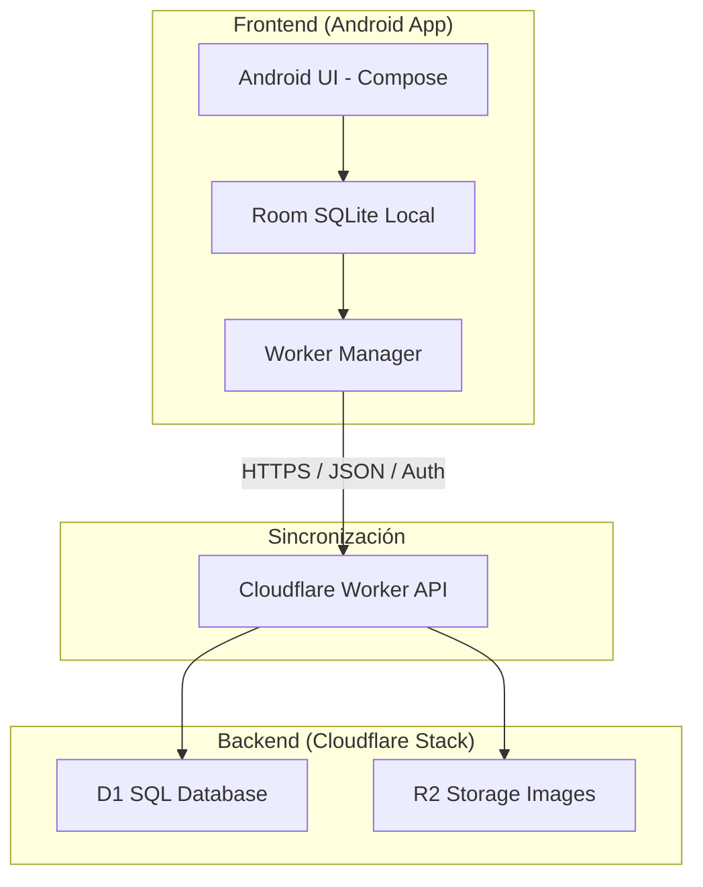

# Arquitectura — RatitagGym

## Vista General del Sistema

La plataforma sigue una arquitectura de **Sincronización Offline-First**, conectando una aplicación móvil nativa con un backend distribuido (Edge Computing).



### Tecnologías Clave

| Componente | Tecnología | Rol |
|---|---|---|
| **Android Client** | Kotlin / Jetpack Compose | Interfaz de usuario, persistencia local y lógica de negocio. |
| **Local DB** | Room (SQLite) | Sincronización offline-first y almacenamiento local. |
| **Backend API** | Cloudflare Workers (Hono) | API REST escalable en el Edge. |
| **Backend DB** | Cloudflare D1 (SQLite) | Base de datos relacional global. |
| **Cloud Storage** | Cloudflare R2 | Almacenamiento de imágenes de ejercicios. |
| **Auth** | Bearer Tokens (Custom) | Seguridad en la comunicación App <-> Worker. |

---

## Patrón General (Android)

```
UI (Compose Screens)
      ↓  observa StateFlow / eventos
ViewModels
      ↓  llama
Use Cases  (lógica de aplicación)
      ↓  consulta / escribe
Repositories  (coordinan fuentes de datos)
      ↓  ejecuta queries
DAOs  (Room / SQLite)
```

Cada capa solo conoce a la inmediatamente inferior. La UI nunca toca DAOs ni entidades Room directamente.

---

## Estructura de Carpetas

```
app/src/main/java/com/example/myapp/
│
├── data/                          ← Capa de datos
│   ├── database/
│   │   └── DatabaseBuilder.kt         Singleton de Room con double-checked locking y seed
│   ├── local/
│   │   ├── AppDatabase.kt             @Database: declara entidades y versión (v25)
│   │   ├── dao/                       Interfaces Room con queries
│   │   │   ├── UsuarioDao.kt
│   │   │   ├── EjercicioDao.kt
│   │   │   ├── RutinaDao.kt
│   │   │   ├── RutinaAccesoDao.kt
│   │   │   ├── EspecialidadDao.kt
│   │   │   ├── CertificacionDao.kt
│   │   │   ├── ObjetivoDao.kt
│   │   │   ├── SesionRutinaDao.kt
│   │   │   ├── RegistroSerieDao.kt
│   │   │   ├── PlanSemanaDao.kt
│   │   │   ├── PlanDiaDao.kt
│   │   │   ├── PlanDiaFechaDao.kt
│   │   │   ├── PlanAsignacionDao.kt
│   │   │   ├── SesionProgramadaDao.kt
│   │   │   ├── NotificacionDao.kt
│   │   │   ├── SyncCursorDao.kt
│   │   │   └── AsignacionDao.kt       Relación explícita usuario origen -> usuario destino
│   │   └── entities/                  Data classes anotadas con @Entity
│   │       ├── UsuarioEntity.kt
│   │       ├── EjercicioEntity.kt
│   │       ├── RutinaEntity.kt
│   │       ├── RutinaEjercicioEntity.kt
│   │       ├── RutinaAccesoEntity.kt
│   │       ├── EspecialidadEntity.kt
│   │       ├── CertificacionEntity.kt
│   │       ├── ObjetivoEntity.kt
│   │       ├── SesionRutinaEntity.kt
│   │       ├── RegistroSerieEntity.kt
│   │       ├── PlanSemanaEntity.kt
│   │       ├── PlanDiaEntity.kt
│   │       ├── PlanDiaFechaEntity.kt
│   │       ├── PlanAsignacionEntity.kt
│   │       ├── SesionProgramadaEntity.kt
│   │       ├── NotificacionEntity.kt
│   │       ├── SyncCursorEntity.kt
│   │       └── AsignacionEntity.kt        Relación explícita usuario origen -> usuario destino
│   └── repository/                    Implementaciones concretas de repositorios
│       ├── AuthRepository.kt              Login, registro, sesión
│       ├── AsignacionRepository.kt        Reglas de asignación (rol origen -> destino)
│       ├── AlumnoRepository.kt            Datos y alumnos vinculados al entrenador
│       ├── EntrenadorRepository.kt        Datos del entrenador
│       ├── RutinaRepository.kt            CRUD de rutinas, ejercicios, accesos
│       ├── SeguimientoRepository.kt       Sesiones activas y registros de series
│       └── PlanRepository.kt             Planes semanales y materializador idempotente
│
├── domain/                        ← Capa de dominio (pura Kotlin, sin Android)
│   ├── models/                        Modelos de negocio (distintos de las entidades Room)
│   │   ├── Usuario.kt
│   │   ├── Rol.kt                     Enum: ENTRENADOR / ALUMNO
│   │   ├── Entrenador.kt
│   │   └── Alumno.kt
│   └── use_cases/                     Lógica de aplicación encapsulada
│       ├── LoginUseCase.kt                Valida credenciales vía AuthRepository
│       ├── RegisterUsuarioUseCase.kt      Hashea contraseña y persiste usuario
│       └── GestionAsignacionesUseCase.kt  Gestiona vínculo usuario-origen -> usuario-destino
│
├── ui/                            ← Capa de presentación (Jetpack Compose)
│   ├── theme/                         Material 3 theming
│   │   ├── Color.kt
│   │   ├── Theme.kt
│   │   └── Type.kt
│   ├── navigation/                    Sistema de navegación
│   │   ├── Routes.kt                  Constantes de rutas (strings)
│   │   └── NavGraph.kt                NavHost con todas las rutas registradas
│   ├── main/                          Punto de entrada
│   │   ├── MainActivity.kt            Única Activity — arranca el NavHost
│   │   ├── MainScreen.kt              Pantalla raíz con ModalNavigationDrawer
│   │   └── MainViewModel.kt           Carga sesión activa al inicio
│   ├── auth/
│   │   ├── login/
│   │   │   ├── LoginScreen.kt
│   │   │   └── LoginViewModel.kt
│   │   └── registro/
│   │       ├── RegisterScreen.kt
│   │       └── RegisterViewModel.kt
│   ├── entrenador/
│   │   ├── EntrenadorHomeScreen.kt    Dashboard del entrenador (tiles de navegación)
│   │   └── EntrenadorHomeViewModel.kt
│   ├── alumno/
│   │   ├── AlumnoHomeScreen.kt        Dashboard del alumno
│   │   └── AlumnoHomeViewModel.kt
│   ├── rutinas/                       Flujo completo de gestión de rutinas
│   │   ├── RutinasScreen.kt           Lista de rutinas (propias + asignadas)
│   │   ├── RutinasViewModel.kt
│   │   ├── RutinaDetalleScreen.kt     Ver detalle + clonar
│   │   ├── RutinaDetalleViewModel.kt
│   │   ├── RutinaEditorScreen.kt      Crear / editar rutina
│   │   ├── RutinaEditorViewModel.kt
│   │   ├── AgregarEjercicioScreen.kt  Búsqueda y selección de ejercicios
│   │   ├── AgregarEjercicioViewModel.kt
│   │   ├── EjercicioImagen.kt          Composable reutilizable para imagen remota con fallback
│   │   └── IconoHelper.kt             Mapeo grupo muscular → ícono
│   ├── metafit/                       Flujo de ejecución de sesión
│   │   ├── MetaFitScreen.kt           Historial de sesiones completadas
│   │   ├── MetaFitViewModel.kt
│   │   ├── SeguimientoRutinaScreen.kt Pantalla activa de sesión (registra series en tiempo real)
│   │   └── SeguimientoRutinaViewModel.kt
│   ├── components/
│   │   └── AtlasComponents.kt         Componentes Compose reutilizables
│   └── ViewModelFactory.kt            Factoría manual (sin Hilt): construye ViewModels con sus dependencias
│
└── utils/                         ← Utilidades transversales
    ├── PasswordHasher.kt              SHA-256 para hashear contraseñas
    ├── PasswordUtils.kt               Validaciones de contraseña
    └── SessionManager.kt             SharedPreferences: persiste usuario logueado entre sesiones
```

---

## Cómo Fluye una Operación Típica

### Ejemplo: el alumno inicia sesión

```
1. LoginScreen         → usuario escribe email + contraseña
2. LoginViewModel      → llama a LoginUseCase(email, password)
3. LoginUseCase        → hashea la contraseña, llama a AuthRepository.login()
4. AuthRepository      → consulta UsuarioDao.findByEmail(), compara hashes
5. SessionManager      → guarda userId en SharedPreferences
6. LoginViewModel      → emite estado Success con el Rol del usuario
7. NavGraph            → navega a EntrenadorHomeScreen o AlumnoHomeScreen según el Rol
```

### Ejemplo: el entrenador crea una rutina

```
1. RutinaEditorScreen  → formulario con nombre + ejercicios seleccionados
2. RutinaEditorViewModel → llama a RutinaRepository.crearRutina(...)
3. RutinaRepository    → inserta RutinaEntity + RutinaEjercicioEntity (M:N) vía RutinaDao
4. Room                → persiste en SQLite
5. RutinaEditorViewModel → emite estado guardado
6. NavGraph            → regresa a RutinasScreen (lista actualizada vía Flow)
```

### Ejemplo: el alumno ejecuta una sesión

```
1. SeguimientoRutinaScreen  → carga ejercicios de la rutina asignada
2. SeguimientoRutinaViewModel → crea SesionRutinaEntity (estado = EN_CURSO)
3. Por cada serie completada → SeguimientoRepository.registrarSerie() → RegistroSerieEntity
4. Al finalizar → SeguimientoRepository.finalizarSesion()
                  → actualiza SesionRutinaEntity (estado = COMPLETADA, fechaFin)
                  → marca SesionProgramada como completada en el calendario
5. NavGraph → navega a MetaFitScreen (historial actualizado)
```

---

## Decisiones de Diseño Clave

| Decisión | Detalle |
|---|---|
| **Single Activity** | `MainActivity` es la única Activity. Toda la navegación es Compose puro con `NavHost`. |
| **DI Manual** | Sin Hilt ni Koin. `ViewModelFactory` construye cada ViewModel pasando las dependencias a mano. |
| **Roles en DB** | El campo `rol` en `UsuarioEntity` determina qué dashboard y qué datos ve cada usuario. |
| **Sesión persistente** | `SessionManager` guarda el `userId` en `SharedPreferences`. Al abrir la app, `MainViewModel` recarga la sesión y redirige automáticamente. |
| **Seed idempotente** | `DatabaseBuilder.onOpen` inserta los 48 ejercicios y 4 rutinas preset solo si no existen, usando un flag. |
| **Imágenes en ejercicios** | `EjercicioEntity` incluye `imageUrl` nullable. UI carga con Coil y fallback local genérico cuando falta URL o falla la carga. |
| **Calendario** | `PlanRepository` contiene un materializador semanal idempotente: genera automáticamente `PlanDia` + `SesionProgramada` para la semana si no existen aún. Se permiten múltiples planes activos por usuario. |
| **Asignaciones explícitas** | `asignaciones` modela la relación usuario-origen→usuario-destino usando dos FK a `usuarios`. El repositorio valida `rol=ENTRENADOR` para origen y `rol=ALUMNO` para destino. |
| **SHA-256** | Las contraseñas nunca se guardan en texto plano. `PasswordHasher` las hashea antes de persistir o comparar. |
| **Migración DB** | Existen migraciones explícitas hasta la versión 25. Se mantiene `fallbackToDestructiveMigration()` para versiones no cubiertas. |

---

## Pantallas Registradas en NavGraph

| Ruta | Pantalla | Rol |
|---|---|---|
| `login` | `LoginScreen` | Todos |
| `register` | `RegisterScreen` | Todos |
| `main` | `MainScreen` | Todos (wrapper con drawer) |
| `notificaciones` | `NotificacionesScreen` | Todos |
| `entrenador_home` | `EntrenadorHomeScreen` | Entrenador |
| `alumno_home` | `AlumnoHomeScreen` | Alumno |
| `rutinas_alumno/{alumnoId}` | `RutinasScreen` | Ambos |
| `rutina_detalle/{rutinaId}/{idUsuario}` | `RutinaDetalleScreen` | Ambos |
| `crear_rutina/{alumnoId}` | `RutinaEditorScreen` | Entrenador |
| `agregar_ejercicio/{rutinaId}` | `AgregarEjercicioScreen` | Entrenador |
| `meta_fit/{userId}` | `MetaFitScreen` (historial) | Alumno |
| `seguimiento_rutina/{rutinaId}/{userId}/{sesionProgramadaId}` | `SeguimientoRutinaScreen` | Alumno |
| `detalle_alumno/{alumnoId}` | `DetalleAlumnoScreen` | Entrenador |
| `planes/{idCreador}` | `PlanesScreen` | Entrenador |
| `plan_detalle/{idCreador}/{idPlan}` | `PlanDetalleScreen` | Entrenador |
| `plan_editor/{idCreador}` | `PlanEditorScreen` | Entrenador |
| `plan_asignaciones/{idCreador}/{idPlan}` | `PlanAsignacionesScreen` | Entrenador |
| `trainers/{alumnoId}` | `TrainersScreen` | Alumno |
| `detalle_trainer/{trainerId}/{alumnoId}` | `DetalleTrainerScreen` | Alumno |
| `formulario_certificacion/{userId}` | `FormularioCertificacionScreen` | Entrenador |
| `formulario_especializacion/{userId}` | `FormularioEspecializacionScreen` | Entrenador |
